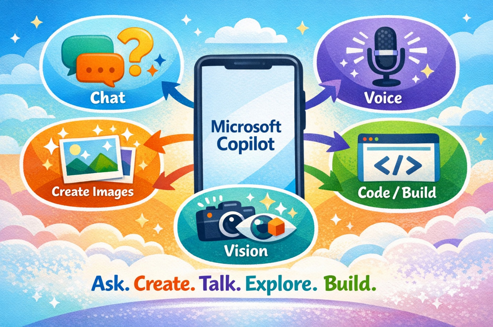
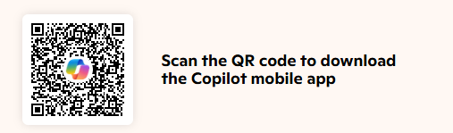

# South Auckland to the Tech World 2

## Copilot Activities Run Down

**Day 1 — Primary School & Intermediate Audience**

**Tech Week 2026 | Tuesday 19 May 2026**

*16 hands-on Copilot activities*

---

## Microsoft Copilot App Overview

*The Microsoft Copilot app can help students ask questions, talk, create images, explore the world with vision, and build simple digital projects.*

Microsoft Copilot is an AI helper that students can use to ask, create, and explore.

- Ask questions and get simple answers
- Talk to Copilot using voice
- Create pictures from ideas
- Use Copilot Vision to explore objects or text
- Help write stories, plans, and class work
- Build simple webpages, quizzes, and tools
- Learn how better prompts give better results

Copilot helps students learn by trying ideas, improving prompts, and creating things in fun new ways.

[Get Copilot for desktop or download the Copilot app on Android or iPhone](https://www.microsoft.com/en-nz/microsoft-copilot/for-individuals/get-copilot)

---

## Overview

This run down captures sixteen Copilot activities designed for primary school and intermediate students (Years 3–8, ages 7–13). Each activity is factual, runnable on the free Copilot app or [https://copilot.microsoft.com](https://copilot.microsoft.com), and sized so that any 3–4 of them fit inside a 30-minute workshop session. Activities cover the full Copilot family — text, image, voice, Vision, and code generation.

Every activity follows the same structure so students can pick them up and run them with minimal prep:

- A clear time estimate, audience, and skill focus
- A short "why it works" rationale
- A numbered step-by-step lab
- An exact prompt template students can copy and paste
- A take-home item that turns the activity into a memento
- A one-line learning outcome to anchor the wrap-up

---

## Activities at a Glance

| # | Activity | Time | Audience | Tool |
|---|----------|------|----------|------|
| 1 | [🎨 Design Your Magical Aiga Creature](labs/activity-01-design-your-magical-aiga-creature.md) | 5 min | Years 3–8 | Copilot (image generation) |
| 2 | [📖 Tell My Aiga's Story](labs/activity-02-tell-my-aigas-story.md) | 5 min | Years 4–8 | Copilot (text) |
| 3 | [🌺 Pasifika Pattern Lab](labs/activity-03-pasifika-pattern-lab.md) | 5 min | Years 5–8 | Copilot (image generation) |
| 4 | [🎤 Talanoa with Copilot (Voice mode)](labs/activity-04-talanoa-with-copilot-voice-mode.md) | 5 min | Years 3–6 | Copilot voice (mobile app or web) |
| 5 | [🕵️ Mystery in the Maths Lab](labs/activity-05-mystery-in-the-maths-lab.md) | 5 min | Years 6–8 (intermediate) | Copilot (text) |
| 6 | [🚀 Time Machine: 100 Years From Now](labs/activity-06-time-machine-100-years-from-now.md) | 5 min | Years 5–8 | Copilot (text + image) |
| 7 | [🎭 Make Copilot Funny (Joke Lab)](labs/activity-07-make-copilot-funny-joke-lab.md) | 5 min | All ages — perfect ice-breaker | Copilot (text) |
| 8 | [✉️ Letter to Future Me](labs/activity-08-letter-to-future-me.md) | 5 min | Years 7–8 | Copilot (text) |
| 9 | [🔍 Copilot Vision Adventure](labs/activity-09-copilot-vision-adventure.md) | 5 min | Years 3–8 | Copilot Vision (mobile app — camera mode) |
| 10 | [📷 Copilot Vision Homework Detective](labs/activity-10-copilot-vision-homework-detective.md) | 5 min | Years 5–8 | Copilot Vision (mobile app) |
| 11 | [💻 Build My First Webpage](labs/activity-11-build-my-first-webpage.md) | 10 min | Years 6–8 | Copilot (text) + Notepad/TextEdit + web browser |
| 12 | [🎮 Make a Mini Quiz Game](labs/activity-12-make-a-mini-quiz-game.md) | 10 min | Years 7–8 | Copilot (text) + Notepad/TextEdit + web browser |
| 13 | [🛠️ Build a Mini Tool That Solves a Real Problem](labs/activity-13-build-a-mini-tool-that-solves-a-real-problem.md) | 10 min | Years 7–8 | Copilot (text) + Notepad/TextEdit + web browser |
| 14 | [🏪 Design My Aiga Business](labs/activity-14-design-my-aiga-business.md) | 10 min | Years 5–8 | Copilot (image + text) |
| 15 | [🎙️ Sports Commentator Mode](labs/activity-15-sports-commentator-mode.md) | 5 min | Years 4–8 | Copilot (text) + Copilot voice for read-out |
| 16 | [🍳 Recipe Remix Lab](labs/activity-16-recipe-remix-lab.md) | 5 min | Years 3–8 | Copilot (text + image) |

---

## How to Access Microsoft Copilot for Free

Students, whānau, and facilitators can use the free personal version of Microsoft Copilot either in a web browser or through the mobile app. Both options let you chat, ask questions, create images, and try many of the activities in this guide.

### Option 1: Use Copilot in a Web Browser

1. Open Microsoft Edge or Google Chrome.
2. Go to the Microsoft Copilot website at [https://copilot.microsoft.com](https://copilot.microsoft.com)
3. You can stay logged out or sign in with a free Microsoft or Google account to keep your exercises.
4. Start typing or speaking your prompt.

This option works well on laptops, desktops, and school devices with internet access.

### Option 2: Download the Copilot Mobile App

1. On Android, open the Google Play Store and search for **Microsoft Copilot**.
2. On iPhone, open the App Store and search for **Microsoft Copilot**.
3. Download the app, sign in with a free Microsoft account, and begin using chat, voice, and image features.

The mobile app is useful for activities that use voice mode or camera-based Copilot Vision.

> **Note:** Some features may vary by device, age, region, or sign-in status, but the free version is enough for many of the activities in this run down.

---

## The Activities

Each of the next sixteen pages covers one activity in detail. Click any activity below to get started:

- [🎨 Design Your Magical Aiga Creature](labs/activity-01-design-your-magical-aiga-creature.md)
- [📖 Tell My Aiga's Story](labs/activity-02-tell-my-aigas-story.md)
- [🌺 Pasifika Pattern Lab](labs/activity-03-pasifika-pattern-lab.md)
- [🎤 Talanoa with Copilot (Voice mode)](labs/activity-04-talanoa-with-copilot-voice-mode.md)
- [🕵️ Mystery in the Maths Lab](labs/activity-05-mystery-in-the-maths-lab.md)
- [🚀 Time Machine: 100 Years From Now](labs/activity-06-time-machine-100-years-from-now.md)
- [🎭 Make Copilot Funny (Joke Lab)](labs/activity-07-make-copilot-funny-joke-lab.md)
- [✉️ Letter to Future Me](labs/activity-08-letter-to-future-me.md)
- [🔍 Copilot Vision Adventure](labs/activity-09-copilot-vision-adventure.md)
- [📷 Copilot Vision Homework Detective](labs/activity-10-copilot-vision-homework-detective.md)
- [💻 Build My First Webpage](labs/activity-11-build-my-first-webpage.md)
- [🎮 Make a Mini Quiz Game](labs/activity-12-make-a-mini-quiz-game.md)
- [🛠️ Build a Mini Tool That Solves a Real Problem](labs/activity-13-build-a-mini-tool-that-solves-a-real-problem.md)
- [🏪 Design My Aiga Business](labs/activity-14-design-my-aiga-business.md)
- [🎙️ Sports Commentator Mode](labs/activity-15-sports-commentator-mode.md)
- [🍳 Recipe Remix Lab](labs/activity-16-recipe-remix-lab.md)

---

## Sharing Your Work

After completing any activity, you can email your work to yourself or your whānau:

Share it via email by clicking the **Share** button in Copilot, selecting email, and entering the student or whānau email address.

