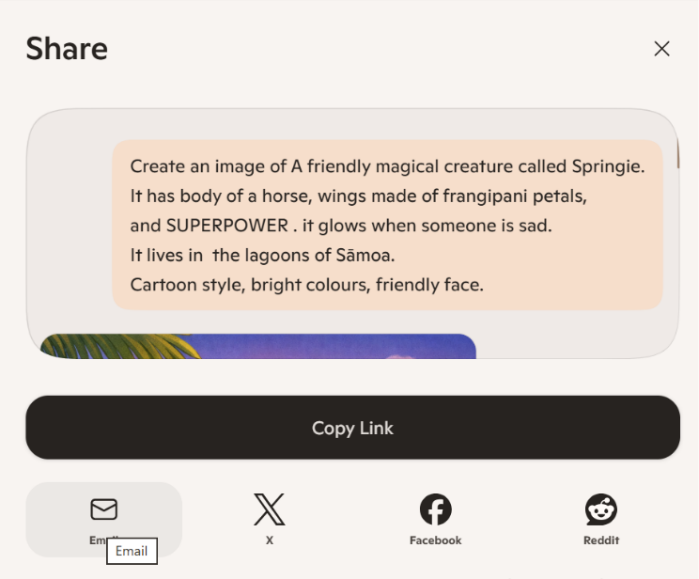

# Activity 1: 🎨 Design Your Magical Aiga Creature

[← Back to Activities](../README.md)

| | |
|---|---|
| **Time** | 5 min |
| **Audience** | Years 3–8 |
| **Skill** | Image generation + descriptive language |
| **Tool** | Copilot (image generation) |

> **Why it works:** Kids love creatures. They learn that AI listens to detail — the more specific your words, the cooler the result.

## Step-by-step lab

1. Imagine your own guardian creature for your aiga. Think about details like fur or scales, glowing eyes, wings, size, colours, and what makes it special.
2. Fill in the prompt template with your own ideas.
3. Type your prompt into Copilot and generate an image based on your prompt.
4. Choose your favourite image, add one more detail to your prompt, and generate it again.
5. Share your creature with a partner and introduce it in one sentence.
## Prompt template

```text
Create an image of a friendly magical creature called [NAME].It has [BODY TYPE — e.g. body of a turtle],[SPECIAL FEATURES — e.g. wings made of frangipani petals],and [SUPERPOWER — e.g. it glows when someone is sad].It lives in [PLACE — e.g. the lagoons of Sāmoa].Cartoon style, bright colours, friendly face.
```

**Sample prompt 1**

```text
Create an image of a friendly magical creature called Lani. It has the body of a turtle, wings made of frangipani petals, and it glows when someone is sad. It lives in the lagoons of Sāmoa. Cartoon style, bright colours, friendly face.
```

**Sample prompt 2**

```text
Create an image of a friendly magical creature called Tasi. It has the body of a gecko, a shiny shell, and rainbow feathers. Its superpower is making storms go away. It lives near the beaches of South Auckland. Cartoon style, bright colours, friendly face.
```

## Email it to yourself or your whanau for showing what you've accomplished

Share it via email by clicking the Share button in Copilot, selecting email, and entering the student or whānau email address.




## Learning outcome

AI follows your instructions exactly. Better words = better picture.
