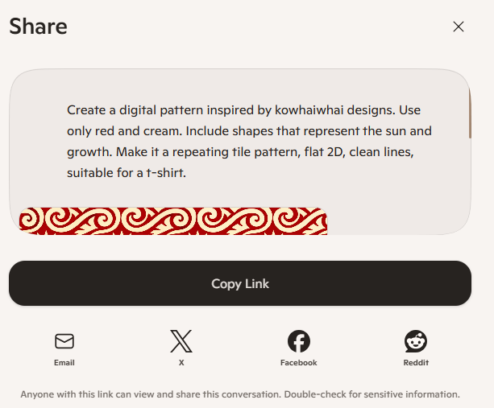

# Activity 3: 🌺 Pasifika Pattern Lab

[← Back to Activities](../README.md)

| | |
|---|---|
| **Time** | 5 min |
| **Audience** | Years 5–8 |
| **Skill** | Cultural design + iterative prompting |
| **Tool** | Copilot (image generation) |

> **Why it works:** Students see how AI can riff on cultural patterns — and learn the responsibility that comes with that.

## Step-by-step lab

1. Look at a few example Pacific-inspired patterns and notice the shapes, lines, and meanings they can represent.
2. Choose a style you want to be inspired by and pick 2 colours for your design.
3. Use the prompt template in Copilot to generate your first pattern.
4. Look closely at your result and decide what to improve. You might make it simpler, bolder, cleaner, or more detailed.
5. Refine your prompt and generate a new version until you have a favourite.
## Prompt template

```text
Create a digital pattern inspired by Pacific [tapa / tatau / kowhaiwhai] designs.Use only [2 COLOURS — e.g. black and burnt orange].Include shapes that represent [THEME — e.g. ocean waves, family, sun].Make it a repeating tile pattern, flat 2D, clean lines, suitable for a t-shirt.
```

**Sample prompt 1**

```text
Create a digital pattern inspired by Pacific tapa designs. Use only black and burnt orange. Include shapes that represent ocean waves and family. Make it a repeating tile pattern, flat 2D, clean lines, suitable for a t-shirt.
```

**Sample prompt 2**

```text
Create a digital pattern inspired by kowhaiwhai designs. Use only red and cream. Include shapes that represent the sun and growth. Make it a repeating tile pattern, flat 2D, clean lines, suitable for a t-shirt.
```

## Email it to yourself or your whanau for showing what you've accomplished

Share it via email by clicking the Share button in Copilot, selecting email, and entering the student or whānau email address.



## Learning outcome

AI can riff on your culture, but the meaning comes from you. Frame this as 'inspired by' — talk about who owns cultural designs and why we always credit the source.
