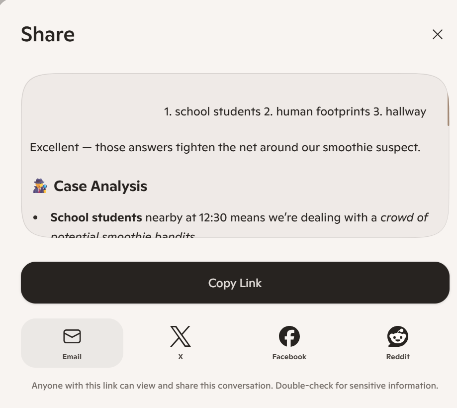

# Activity 5: 🕵️ Mystery in the Maths Lab

[← Back to Activities](../README.md)

| | |
|---|---|
| **Time** | 5 min |
| **Audience** | Years 6–8 (intermediate) |
| **Skill** | Reasoning + prompt iteration |
| **Tool** | Copilot (text) |

> **Why it works:** Students see how Copilot reasons step-by-step, and how the information they give shapes the conclusion.

## Step-by-step lab

1. Read the mystery clues carefully.
2. Copy the prompt template into Copilot and include all 5 clues.
3. Answer Copilot's follow-up questions with your own ideas.
4. Read Copilot's best guess and decide whether you agree.
5. Compare your result with someone else's and notice how different answers can happen from different information.
## Prompt template

```text
You are a detective. Here are 5 clues about a missing koko samoa:1. The room was locked from 12:45 to 1:152. Mrs Tupou had a 1pm class3. There was chocolate on the door handle4. The window was open 5cm5. A cat was seen running awayAsk me 3 questions to help solve the case, then give me your best guess.
```

**Sample prompt 1**

```text
You are a detective. Here are 5 clues about a missing mango smoothie: 1. The cup was last seen at 12:30. 2. There were sticky footprints near the table. 3. The fridge door was open. 4. A straw was found on the floor. 5. Someone heard giggling. Ask me 3 questions to help solve the case, then give me your best guess.
```

**Sample prompt 2**

```text
You are a detective. Here are 5 clues about a missing lunchbox: 1. It disappeared after morning tea. 2. The bench had crumbs on it. 3. The classroom door was open. 4. A friend saw a backpack moving. 5. A note said “Thanks!”. Ask me 3 questions to help solve the case, then give me your best guess.
```

## Email it to yourself or your whanau for showing what you've accomplished

Share it via email by clicking the Share button in Copilot, selecting email, and entering the student or whānau email address.



## Learning outcome

AI thinks step-by-step. The information you give it shapes the answer.
