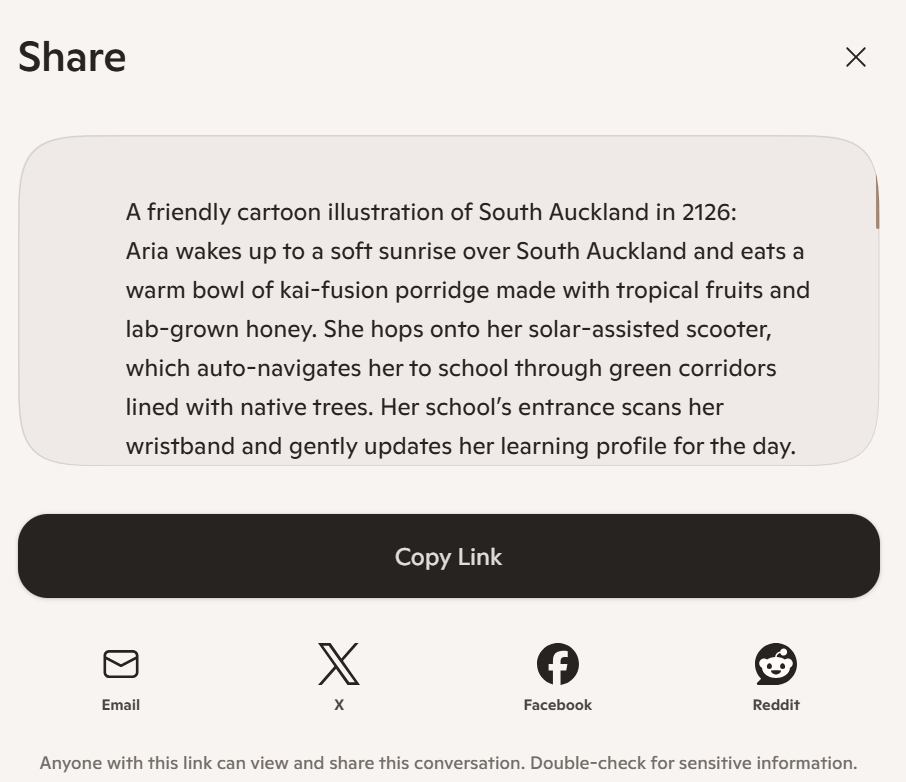

# Activity 6: 🚀 Time Machine: 100 Years From Now

[← Back to Activities](../README.md)

| | |
|---|---|
| **Time** | 5 min |
| **Audience** | Years 5–8 |
| **Skill** | Imagination + image generation + writing combo |
| **Tool** | Copilot (text + image) |

> **Why it works:** Combines Copilot's text and image abilities, and gets students projecting themselves into a hopeful future.

## Step-by-step lab

1. Fill in your name and run Prompt 1 in Copilot.
2. Read Copilot's future story and choose 2 details you like best.
3. Copy those 2 details into Prompt 2 and ask Copilot to create the image.
4. Share your future world with a partner and explain what stayed the same and what changed.
## Prompt template

```text
PROMPT 1 (text): (Copy the output from Prompt 1 into the Prompt 2)Imagine the year 2126 in South Auckland.Describe a normal Tuesday morning for a 10-year-old kid named [NAME].What do they eat for breakfast? How do they get to school?What do classrooms look like? Use 5 short sentences.PROMPT 2 (image): A friendly cartoon illustration of South Auckland in 2126:[PASTE 2 DETAILS FROM COPILOT'S STORY].Bright, hopeful, with Pacific Islander kids. Wide shot.
```

**Sample prompt 1 (Cop**

```text
Imagine the year 2126 in South Auckland. Describe a normal Tuesday morning for a 10-year-old kid named Aria. What do they eat for breakfast? How do they get to school? What do classrooms look like? Use 5 short sentences.
```

**Sample prompt 2**

```text
A friendly cartoon illustration of South Auckland in 2126:Aria wakes up to a soft sunrise over South Auckland and eats a warm bowl of kai-fusion porridge made with tropical fruits and lab-grown honey. She hops onto her solar-assisted scooter, which auto-navigates her to school through green corridors lined with native trees. Her school’s entrance scans her wristband and gently updates her learning profile for the day. Classrooms are bright, flexible spaces where holographic projectors float lessons in mid-air and kids collaborate in mixed-reality pods. By mid-morning, Aria is already deep into a group project exploring Aotearoa climate habitats in an immersive simulation.Bright, hopeful, with Pacific Islander kids. Wide shot.
```

## Email it to yourself or your whanau for showing what you've accomplished

Share it via email by clicking the Share button in Copilot, selecting email, and entering the student or whānau email address.



## Learning outcome

AI can help you visualise the future — but the vision is yours.
