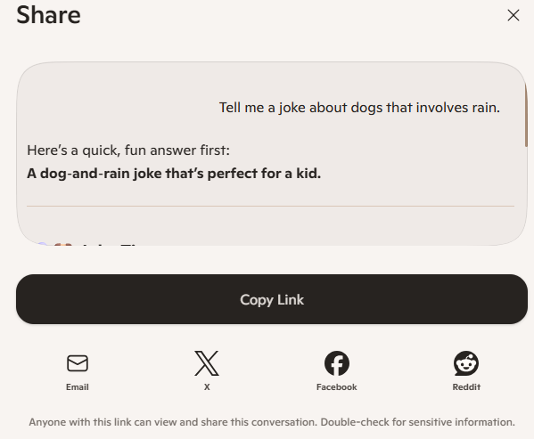

# Activity 7: 🎭 Make Copilot Funny (Joke Lab)

[← Back to Activities](../README.md)

| | |
|---|---|
| **Time** | 5 min |
| **Audience** | All ages — perfect ice-breaker |
| **Skill** | Iterative prompting |
| **Tool** | Copilot (text) |

> **Why it works:** The fastest, most fun way to teach prompt engineering. Kids laugh, then realise: more detail = funnier joke.

## Step-by-step lab

1. Type "Tell me a joke about cats" into Copilot and read the joke.
2. Make the prompt more specific by adding a detail, such as Auckland traffic.
3. Make it even more specific by saying who the joke is for, such as a 7-year-old.
4. Change the style of the joke, for example by asking for a knock-knock joke.
5. Decide which version is funniest and explain why.
## Prompt template

```text
ROUND 1: Tell me a joke about cats.ROUND 2: Tell me a joke about cats that involves Auckland traffic.ROUND 3: Tell me a joke about cats and Auckland traffic that a 7-year-old would laugh at.ROUND 4: Tell me a knock-knock joke about cats and Auckland traffic for a 7-year-old.
```

**Sample prompt 1**

```text
Tell me a joke about dogs that involves rain.
```

**Sample prompt 2**

```text
Tell me a knock-knock joke about cats and Auckland traffic for a 7-year-old.
```

## Email it to yourself or your whanau for showing what you've accomplished

Share it via email by clicking the Share button in Copilot, selecting email, and entering the student or whānau email address.



## Learning outcome

More detail = funnier joke. This is called prompt engineering — and it's a real job.
