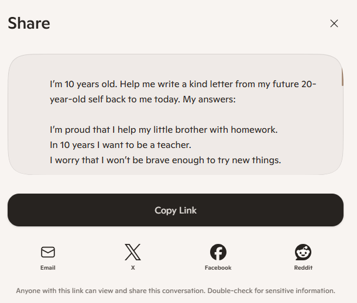

# Activity 8: ✉️ Letter to Future Me

[← Back to Activities](../README.md)

| | |
|---|---|
| **Time** | 5 min |
| **Audience** | Years 7–8 |
| **Skill** | Reflection + AI as thinking partner |
| **Tool** | Copilot (text) |

> **Why it works:** A reflective close to a session — students leave with something personal and emotional.

## Step-by-step lab

1. Answer these 3 questions on paper: What are you proud of right now? What do you want to be doing in 10 years? What is one thing you are worried about?
2. Copy the prompt into Copilot and paste in your 3 answers.
3. Read the letter carefully and make any changes you want so it sounds right for you.
4. Save or print your letter to take home.
## Prompt template

```text
I'm 12 years old. Help me write a kind letter from my future 22-year-old selfback to me today. My answers:[PASTE 3 ANSWERS].Make the letter warm, encouraging, in 4 short paragraphs.Use simple words. End with one piece of advice.
```

**Sample prompt 1**

```text
I’m 10 years old. Help me write a kind letter from my future 20-year-old self back to me today. My answers: I’m proud that I help my little brother with homework. In 10 years I want to be a teacher. I worry that I won’t be brave enough to try new things. Make the letter warm, encouraging, in 4 short paragraphs. Use simple words. End with one piece of advice.
```

**Sample prompt 2**

```text
I’m 12 years old. Help me write a kind letter from my future 22-year-old self back to me today. My answers: I’m proud that I made the rugby team. In 10 years I want to design games. I worry about making mistakes in front of people. Make the letter warm, encouraging, in 4 short paragraphs. Use simple words. End with one piece of advice.
```

## Email it to yourself or your whanau for showing what you've accomplished

Share it via email by clicking the Share button in Copilot, selecting email, and entering the student or whānau email address.



## Learning outcome

AI can help you reflect — and a few good questions can change how you see your future.
