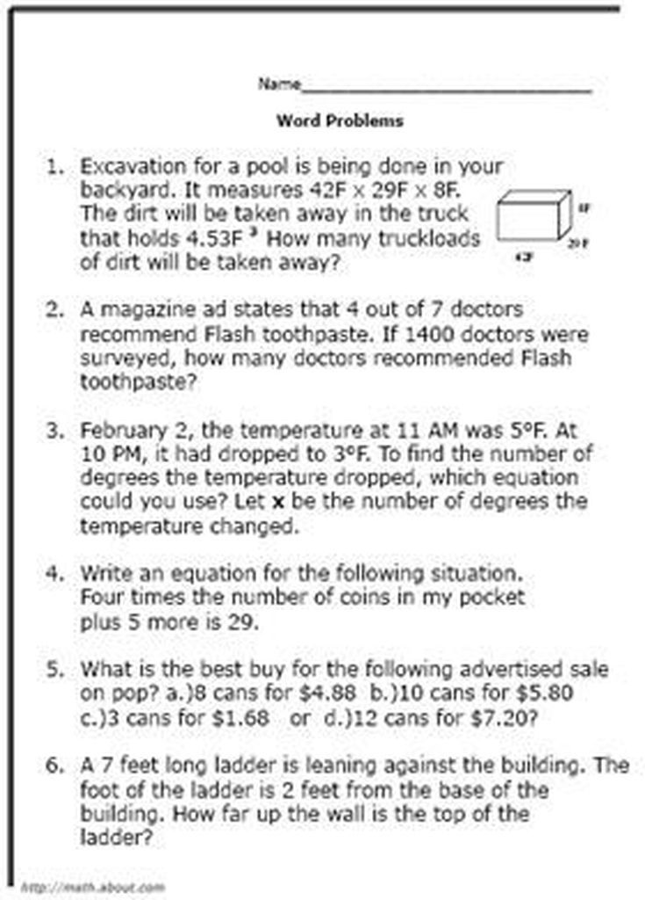

# Activity 10: 📷 Copilot Vision Homework Detective

[← Back to Activities](../README.md)

| | |
|---|---|
| **Time** | 5 min |
| **Audience** | Years 5–8 |
| **Skill** | Visual problem solving + step-by-step reasoning |
| **Tool** | Copilot Vision (mobile app) |

> **Why it works:** Shows students how Vision turns into a study buddy — they realise this is something they can actually use after Tech Week.

## Step-by-step lab

1. Look at the worksheet with the maths problem, science diagram, and reading paragraph.
2. Point Copilot Vision at the maths problem and ask it to explain the steps without giving the answer. Work through the steps yourself on paper.
3. Point Copilot Vision at the science diagram and ask it to explain each labelled part in simple words. Then ask it to quiz you with 3 questions.
4. Point Copilot Vision at the reading paragraph and ask it to summarise the text in 2 sentences and explain any tricky words.
5. Think about when using Copilot like this helps you learn and when it would become copying instead of learning.
## Sample Math Problem



## Prompt template

```text
(Point camera at the problem or text and speak)MATHS: "Don't give me the answer. Explain how to solve this step by step,the way a teacher would."SCIENCE: "What is this diagram showing? Explain each labelin simple words a 10-year-old can understand."Then: "Now quiz me with 3 questions about this."READING: "Summarise this in 2 short sentences for a 10-year-old.Then list any tricky words and what they mean."
```

## Email it to yourself or your whanau for showing what you've accomplished

Share it via email by clicking the Share button in Copilot, selecting email, and entering the student or whānau email address.


## Learning outcome

Copilot Vision is a study buddy, not a cheat machine. Use it to understand — not to copy.
