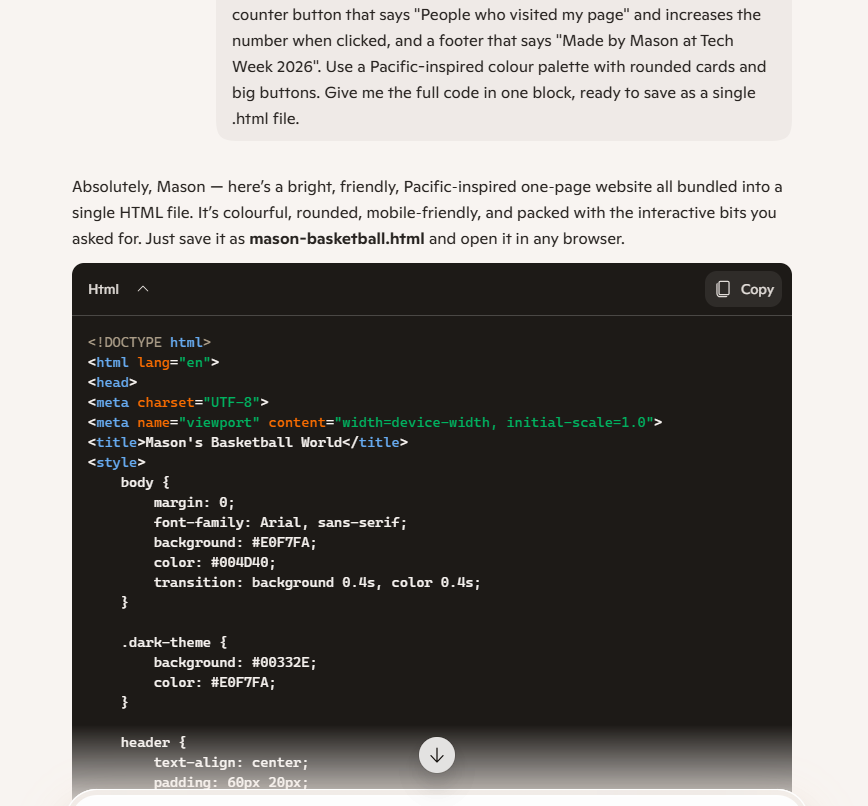
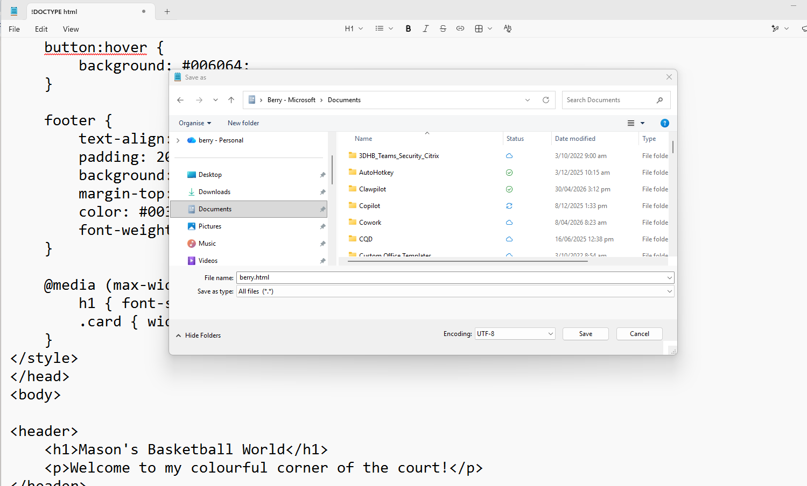
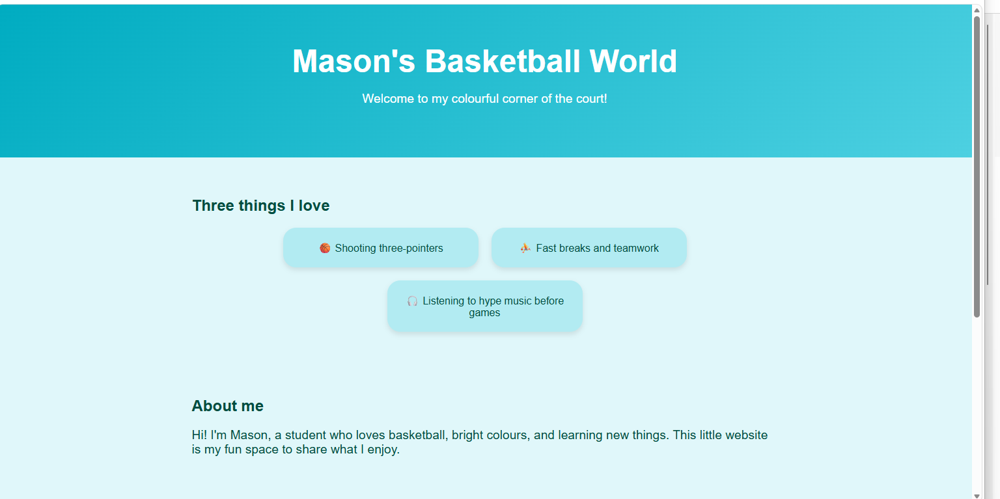
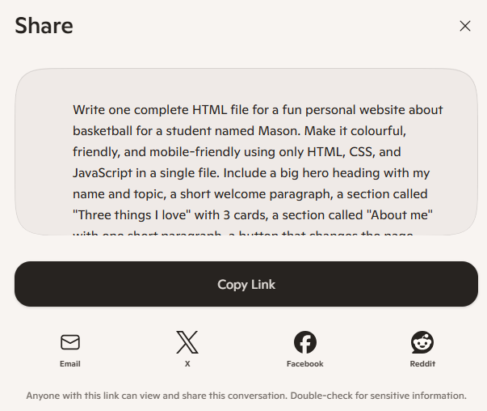

# Activity 11: 💻 Build My First Webpage

[← Back to Activities](../README.md)

| | |
|---|---|
| **Time** | 10 min |
| **Audience** | Years 6–8 |
| **Skill** | Code generation + iteration + real-world output |
| **Tool** | Copilot (text) + Notepad/TextEdit + web browser |

> **Why it works:** The single most empowering moment of the day. Students go from "I can't code" to "I just built a website" in 30 minutes — and they leave with a real .html file.

## Step-by-step lab

1. Open Notepad or TextEdit in plain-text mode, and open Copilot in a browser tab.
2. Choose a topic for your webpage and decide on the main things you want to include.
3. Paste the prompt template into Copilot and replace the topic and name with your own details.
4. Copy the HTML Copilot gives you, paste it into your text editor, and save it as myname.html.
5. Open the file in your browser to see your webpage.
6. Ask Copilot to make changes, such as colours, headings, or lists, then replace the file and refresh the page.
## Prompt template

```text
Write one complete HTML file for a fun personal website about [TOPIC] for a student named [STUDENT NAME].Make it colourful, friendly, and mobile-friendly using only HTML, CSS, and JavaScript in a single file.Include:- A big hero heading with my name and topic- A short welcome paragraph- A section called "Three things I love" with 3 cards- A section called "About me" with one short paragraph- A button that changes the page theme colours- A button that shows a random fun fact about [TOPIC]- A small counter button that says "People who visited my page" and increases the number when clicked- A footer that says "Made by [STUDENT NAME] at Tech Week 2026"Use a Pacific-inspired colour palette (ocean blue, sunset orange, frangipani white) with rounded cards and big buttons.Give me the full code in one block, ready to save as a single .html file.
```

**Sample prompt 1 – Basketball Sport**

```text
Write one complete HTML file for a fun personal website about basketball for a student named Mason. Make it colourful, friendly, and mobile-friendly using only HTML, CSS, and JavaScript in a single file. Include a big hero heading with my name and topic, a short welcome paragraph, a section called "Three things I love" with 3 cards, a section called "About me" with one short paragraph, a button that changes the page theme colours, a button that shows a random fun fact about basketball, a small counter button that says "People who visited my page" and increases the number when clicked, and a footer that says "Made by Mason at Tech Week 2026". Use a Pacific-inspired colour palette with rounded cards and big buttons. Give me the full code in one block, ready to save as a single .html file.
```

**Sample prompt 2 – Rugby Sport**

```text
Write one complete HTML file for a fun personal website about rugby for a student named Leilani. Make it colourful, friendly, and mobile-friendly using only HTML, CSS, and JavaScript in a single file. Include a big hero heading with my name and topic, a short welcome paragraph, a section called "Three things I love" with 3 cards about rugby, family, and music, a section called "About me" with one short paragraph, a button that changes the page theme colours, a button that shows a random fun fact about rugby, a small counter button that says "People who visited my page" and increases the number when clicked, and a footer that says "Made by Leilani at Tech Week 2026". Use a Pacific-inspired colour palette with rounded cards and big buttons. Give me the full code in one block, ready to save as a single .html file.
```







## Email it to yourself or your whanau for showing what you've accomplished

Share it via email by clicking the Share button in Copilot, selecting email, and entering the student or whānau email address.



## Learning outcome

You can build a real thing on the internet in 30 minutes. Code is just a language — Copilot is the translator.
